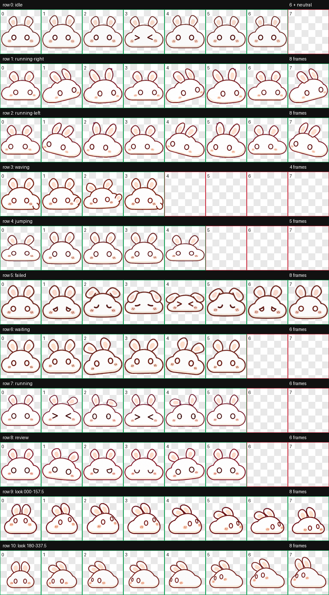

# Cloudbun for Codex

A fun, bouncy cloud-rabbit pet for the Codex desktop app.



## Install

```bash
./scripts/install.sh
```

Then restart Codex and select **Cloudbun** from the pet/customization menu.

## Contents

- `cloudbun/pet.json` — Codex pet manifest (`spriteVersionNumber: 2`)
- `cloudbun/spritesheet.webp` — transparent 8×11 animation atlas
- `assets/contact-sheet.png` — animation preview
- `assets/look-directions.png` — 16-direction QA preview
- `assets/validation.json` — deterministic atlas validation

The atlas is `1536×2288`, using `192×208` cells. It contains nine standard animation rows and sixteen clockwise look directions.

## Uninstall

Remove `~/.codex/pets/cloudbun`, then restart Codex.

